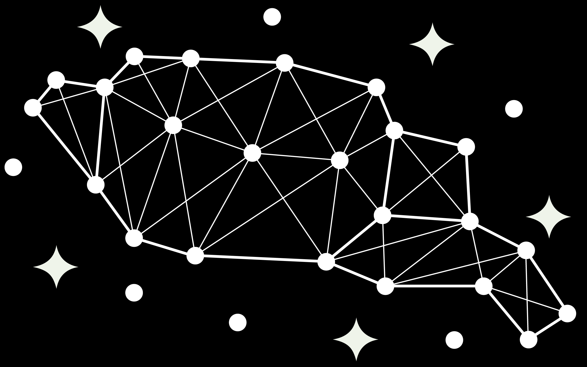

<p align="center">
  
</p>

# Stars2Cells

> **Cross-session cell registration for calcium imaging** — match the same neurons across days using rotation-, translation-, and scale-invariant geometric descriptors.

## Contents

- [Overview](#overview)
- [Key features](#key-features)
- [Pipeline at a glance](#pipeline-at-a-glance)
- [Installation](#installation)
- [Quick start](#quick-start)
- [Input data format](#input-data-format)
- [Output data](#output-data)
- [Repository structure](#repository-structure)
- [Parameter Tuning Guide](#parameter-tuning-guide)
  - [Step 1: Quad Generation](#step-1-quad-generation)
  - [Step 1.5: Threshold Calibration](#step-15-threshold-calibration)
  - [Step 2: Quad Matching](#step-2-quad-matching)
  - [Step 2.5: RANSAC Geometric Filtering](#step-25-ransac-geometric-filtering)
  - [Step 3: Neuron Matching](#step-3-neuron-matching)
  - [General Parameters](#general-parameters)
- [Quick Diagnostic Checklist](#quick-diagnostic-checklist)
- [Reproducibility](#a-note-on-reproducibility)
- [Sample data](#sample-data)
- [Citation and acknowledgments](#citation-and-acknowledgments)

---

## Overview

Stars2Cells tracks individual neurons across multiple calcium-imaging sessions of the same animal. Between sessions the tissue shifts, the field of view rotates and translates, ROI counts change, and centroids jitter — yet a researcher still needs to know that neuron #42 on Monday is the same cell as neuron #88 on Friday.

Instead of matching neurons by raw position, Stars2Cells matches the **geometry of their local constellations**. The idea is borrowed from astronomical star-pattern matching ("plate solving"): describe each small group of points with a signature that does not change when you rotate, translate, or rescale the field, then look for the same signatures in another image. Here the "stars" are neuron centroids and the signatures are **quads** — four-neuron descriptors invariant to translation, rotation, and scale. Hence the name: *Stars2Cells.*

A quad is built from four neurons: two anchor the longest edge (the "diagonal"), and the other two ("third-points") are encoded in a 4D descriptor `(xC, yC, xD, yD)` expressed in a coordinate frame normalized by the diagonal. Two sessions that image the same tissue produce many matching quad descriptors. A RANSAC consensus step then recovers the rigid transform between sessions and rejects coincidental matches, and finally a Hungarian assignment turns the surviving geometric evidence into one-to-one neuron matches and stitches them into cross-session tracks.

The pipeline runs from a **PyQt5 desktop GUI** (load → visualize → configure → run → inspect) or **headless from a script** for batch and HPC use. Both share the same engine and the same parameters.

## Key features

- **Invariant geometric matching** — robust to FOV rotation, translation, and scale changes between sessions; no manual alignment required.
- **Diagonal-first quad generation** — `O(N·k·K)` memory instead of the `O(N³)` of naive triangle enumeration, so it scales to ~1000-neuron sessions.
- **Self-calibrating threshold** — Step 1.5 fits a `τ = C·√N` scaling law so the descriptor-distance threshold adapts to neuron count automatically.
- **RANSAC geometric verification** — every session pair gets a consensus rigid/affine transform; coincidental descriptor matches are filtered out.
- **Confidence-scored matches and tracks** — each pair match and each consolidated track carries a `[0, 1]` reliability score for principled downstream filtering.
- **GUI and headless runner** — interactive PyQt5 viewer with per-step inspectors, or a hard-coded-path script for unattended batch runs.
- **Reproducible** — every parameter is written into the output files, and runs are deterministic given identical inputs (one RNG seed aside).

## Pipeline at a glance

Data flows through five steps. Each reads the previous step's output from a subfolder of your output directory and writes its own:

| Step | Name | What it does | Writes to |
|------|------|--------------|-----------|
| **1** | Quad Generation | Build invariant 4D quad descriptors from neuron centroids (diagonal-first). | `step_1_results/` |
| **1.5** | Threshold Calibration | Fit the `τ = C·√N` descriptor-distance threshold per animal. | `step_1_5_results/` |
| **2** | Quad Matching | Find descriptor-similar quads across session pairs (FAISS or KDTree). | `step_2_results/` |
| **2.5** | RANSAC Filtering | Estimate the session-to-session transform; keep only geometric inliers. | `step_2_5_results/` |
| **3** | Neuron Matching | Padded Hungarian assignment + second-pass recovery → tracks + confidence. | `step_3_results/` |

```
centroids (.npy per session)
      │
 ┌────▼─────┐   ┌──────────────┐   ┌───────────┐   ┌──────────────┐   ┌──────────────────┐
 │  Step 1  │──▶│   Step 1.5   │──▶│  Step 2   │──▶│   Step 2.5   │──▶│      Step 3      │
 │  quads   │   │ threshold √N │   │ matching  │   │   RANSAC     │   │ Hungarian + track│
 └──────────┘   └──────────────┘   └───────────┘   └──────────────┘   └──────────────────┘
                                                                                │
                                                          matched pairs + consolidated tracks
```

Step 1 is the foundation: **bad quads cannot be rescued downstream**, so most tuning starts there. See the [Parameter Tuning Guide](#parameter-tuning-guide) below.

## Installation

Stars2Cells targets **Python 3.10+**. The numeric core (`numpy`, `scipy`, and the optional but recommended `faiss-cpu`) installs best through conda; everything else via pip.

```bash
# 0. Get the code
git clone https://github.com/<your-org>/Stars2Cells.git
cd Stars2Cells

# 1. Create and activate an environment named "s2c"
#    (the Windows launcher expects this exact name)
conda create -n s2c python=3.10 -y
conda activate s2c

# 2. Numeric core via conda (versions the pipeline was developed against)
conda install -c conda-forge numpy=1.26.4 scipy=1.13.0 faiss-cpu -y

# 3. Everything else via pip
pip install -r requirements.txt
```

`faiss-cpu` accelerates Step 2 descriptor matching but is optional — the pipeline falls back to a SciPy KDTree if FAISS cannot be imported. The remaining dependencies (PyQt5, pyqtgraph, scikit-image, scikit-learn, matplotlib, tqdm, Pillow, imageio, tifffile, psutil, networkx) are pinned in `requirements.txt`.

## Quick start

### Option 1 — GUI (interactive)

```bash
python stars2cells.py
```

On Windows you can instead double-click **`launch_s2c.bat`**, which activates the `s2c` conda env and relaunches the app automatically if it crashes.

Then, in the window:

1. **🗂️ Load Data Folder** — point it at a directory of per-session `.npy` files (see [Input data format](#input-data-format)).
2. Browse and, if needed, visually edit or clean sessions in the viewer.
3. Open the **🌟 Stars2Cells Pipeline** panel, set parameters, and run **Steps 1 → 3** in order.
4. Use each step's **inspector** to check coverage, calibration fit, match maps, RANSAC residuals, and final tracks before moving on.

### Option 2 — Headless / scripted (batch and HPC)

Edit the config block at the top of **`s2c_api.py`** — set `INPUT_DIR`, `OUTPUT_DIR`, the `RUN_STEP_*` toggles, and any parameter overrides — then run:

```bash
python s2c_api.py
```

It executes the selected steps end to end with the same progress dialogs as the GUI and logs a per-animal summary (C value, R², match rate, track counts) to stdout and to `OUTPUT_DIR/logs/`.

## Input data format

One `.npy` file per imaging session. The filename encodes the animal and session:

```
^([A-Za-z0-9_]+?)_(\d+)(.*?)\.npy$
   └ animal_id ┘ └ session ┘└ optional suffix ┘
```

For example `408021_758519303.npy` → animal `408021`, session `758519303`. Files for the same animal are grouped and ordered automatically.

Each file contains either (preferred) a pickled dict of centroids or a raw footprint matrix:

```python
import numpy as np

data = {
    'centroids_x': np.array([123.4, 456.7, 789.0, 234.1]),  # N x-coords (pixels)
    'centroids_y': np.array([234.5, 567.8, 890.1, 345.2]),  # N y-coords (pixels)
    'roi_ids':     np.array([0, 1, 2, 3]),                  # optional, unique per session
}
np.save('408021_758519303.npy', data, allow_pickle=True)
```

- **Format 1 (recommended):** dict with `centroids_x`, `centroids_y` (and optional `roi_ids`).
- **Format 2 (fallback):** a 3D `(H, W, N)` footprint matrix; centroids are extracted automatically.
- Sessions need **N ≥ 4** neurons; coordinates are in pixels, in a consistent frame across an animal's sessions.

The complete specification, conversion recipes (Suite2p / CaImAn / EXTRACT), and a validation checklist are in **[`base_data_requirements.txt`](base_data_requirements.txt)**.

## Output data

Results land in your output directory, one subfolder per step. The deliverables are in `step_3_results/`:

- **`*_sweep.npz`** — one per session pair: `matched_ref_indices`, `matched_tgt_indices`, `match_confidence` (`[0, 1]`), and `match_pass` (1 = primary, 2 = recovery), plus centroids and metadata.
- **`{animal_id}_consolidated_tracking.npz`** — global neuron identities across all of an animal's sessions: `neuron_tracks` (`global_id → {session_idx: local_idx}`), `track_lengths`, and `track_confidence` (weakest-link reliability).
- **`step3_summary.json`** — parameters used and per-animal aggregate stats.

Prefer `match_confidence` / `track_confidence` over raw cost when filtering — costs are not comparable across runs. The full output schema, loading code, and analysis workflows (retention, drift, persistent cells) are in **[`exporting_data.txt`](exporting_data.txt)**.

## Repository structure

```
Stars2Cells/
├── stars2cells.py             # PyQt5 GUI entry point (load, visualize, run, inspect)
├── s2c_api.py                 # Headless runner — edit paths/toggles at top, then run
├── launch_s2c.bat             # Windows launcher (activates conda env "s2c", auto-restart)
├── requirements.txt           # pip dependencies (numeric core installed via conda)
├── base_data_requirements.txt # Input .npy format specification
├── exporting_data.txt         # Step 3 output schema + analysis recipes
├── S2C_logo.png
├── steps/                     # The pipeline engine, one module per step
│   ├── step_1_quad_generation.py
│   ├── step_1_5_threshold_generation.py
│   ├── step_2_matching_generator.py
│   ├── step_2_5_RANSAC.py
│   ├── step_3_neuron_matching.py
│   └── step_1_Q_Saturation_Add_On.py   # quad-count saturation estimation
├── utilities/                 # Shared infrastructure
│   ├── step_info.py           # Single source of truth for parameters & step metadata
│   ├── config.py              # PipelineConfig
│   ├── gui_components.py       # Reusable Qt widgets / theming
│   ├── threshold_generator.py
│   └── shared_*_utils.py       # io, logging, parallelism, paths, stats, viewers
├── viewers/                   # Per-step PyQt inspectors (Steps 1, 1.5, 2, 2.5, 3)
└── Sample_Data_Generation/    # Notebooks to synthesize sample data with ground truth
```

> `CellReg_Comparison/` contains auxiliary benchmarking against the MATLAB CellReg tool and is **not part of the core pipeline** — you can ignore it for normal use.

---

## Parameter Tuning Guide

Stars2Cells exposes many parameters by design. The rest of this README is a deep reference for every one — what it does, its default, and the specific symptom that should make you reach for it. The defaults are tuned for 150–400-neuron recordings, so if you just want sensible results on typical data, run with them first and come back here when something looks off.

## Philosophy: Why Are There So Many Knobs?

Calcium imaging data is not uniform. A 100-neuron lateral habenula recording from a head-fixed mouse and a 900-neuron cortical recording from a freely-moving rat produce fundamentally different geometric landscapes. Any attempt to "auto-detect" optimal parameters across this range would either be so conservative it wastes compute on easy datasets, or so aggressive it silently produces garbage on hard ones. 

Every parameter exposed in this pipeline exists because **we tried to automate it and found cases where the automation failed silently**. The cost of a bad automatic default that a user never questions is far higher than the cost of asking you to think about your data for ten minutes. This guide is that ten minutes.

---

## How to Read This Guide

Each parameter includes:

- **What it does** — plain English, then the math if you want it
- **Default** — what ships out of the box and why
- **Too low / Just right / Too high** — concrete examples of what happens at each extreme
- **When to touch it** — the specific symptom that tells you this knob needs turning

Parameters are organized by pipeline step. If you're debugging Step 3 results, start at Step 1. Bad inputs propagate forward and no amount of Step 3 tuning fixes bad quads.

---

## Step 1: Quad Generation

Step 1 builds the descriptors that everything downstream depends on. A quad is four neurons — two forming the "diagonal" (longest edge) and two "third-points" on either side. The 4D descriptor `(xC, yC, xD, yD)` encodes the relative positions of the third-points in a coordinate frame normalized by the diagonal length. This makes descriptors invariant to translation, rotation, and scale — which is the entire point.

The diagonal-first pipeline enumerates diagonals directly (KNN local + random long-range), computes perpendicular heights for all other neurons per diagonal, keeps the top-K by height, and pairs those third-points into quads. No triangle enumeration. No `C(N,3)` blowup. Memory is `O(N·k·K)`.

### `knn_k` — Local Neighborhood Density

**Default:** `15`  
**Range:** `5 – 100`

The number of nearest spatial neighbors used to generate local diagonals per neuron. Long-range diagonals are added automatically at `k_random = knn_k // 2`.

**What this controls:** The density and spatial scale of your diagonal set. More neighbors → more diagonals → more quads → better coverage of spatial relationships, but diminishing returns and more compute.

| Setting | Behavior | Symptom |
|---------|----------|---------|
| `knn_k = 5` | Only the 5 nearest neurons form diagonals. Sparse coverage, fast. | Neurons in sparse regions of the FOV have zero quads. Step 2 can't match them. Coverage remediation fires constantly. |
| `knn_k = 15` | Good coverage for 100–400 neuron recordings. Balances density and compute. | Most neurons participate in hundreds of quads. Coverage remediation is minimal. |
| `knn_k = 40` | Dense coverage. Every neuron has many overlapping diagonals. | Quad counts approach the saturation cap. Compute time scales with `k`. Matching gets slower but not necessarily better — descriptor space gets crowded and similar-looking quads increase false matches. |

**The math:** Total unique diagonals ≈ `N × (knn_k + knn_k//2) / 2`. Each diagonal produces up to `C(K, 2)` quads where `K = max_triangles_per_diagonal`. So quad count scales roughly as `N × k × K²`.

**When to increase:** If the quad estimate panel in the GUI shows neurons with zero coverage, or if Step 2 match rates are low despite good threshold calibration. Your neurons may be too spread out for `k=15` to capture enough spatial structure.

**When to decrease:** If you're hitting the saturation cap and don't want to reduce `quad_keep_fraction`. Or if your recording has very few neurons (< 50) where `k=15` already covers most of the field.

---

### `max_triangles_per_diagonal` (K-cap)

**Default:** `25`  
**Range:** `2 – 500`

For each diagonal, only the top-K third-points (ranked by perpendicular height) are kept. This is applied immediately during diagonal construction — it's not a post-hoc filter.

**What this controls:** How many quads each diagonal can produce. Quads per diagonal = `C(K, 2) = K(K-1)/2`. At K=25, that's 300 quads per diagonal. At K=50, it's 1,225.

| Setting | Behavior | Symptom |
|---------|----------|---------|
| `K = 5` | 10 quads per diagonal. Only the tallest third-points survive. | Very selective — descriptors are well-separated but you miss subtle geometric relationships. Works for small FOVs with < 80 neurons. |
| `K = 25` | 300 quads per diagonal. Good tradeoff for 100–500 neuron recordings. | Descriptors capture both prominent and moderate geometric features. |
| `K = 100` | 4,950 quads per diagonal. Captures everything including very flat quads near the diagonal line. | Massive quad counts, likely exceeding the saturation cap. Many near-degenerate descriptors that add noise without information. Matching slows to a crawl. |

**When to change:** The quad estimate panel in the confirmation dialog shows you the projected count. If you're over the empirical cap (~1.3M quads/session), reduce K. If you're well under it and match rates are poor, increasing K adds geometric diversity.

**Interaction with `quad_keep_fraction`:** K controls how many quads are *generated*. `quad_keep_fraction` controls how many *survive* quality pruning. Both reduce quad count but in different ways — K prunes at the diagonal level (removes flat third-points), while `keep_fraction` prunes at the global level (removes low-quality descriptors by `|yC| + |yD|`). If you need fewer quads, reducing K is faster (less work generated), while reducing `keep_fraction` is more selective (keeps the best quads from everywhere).

---

### `quad_keep_fraction` — Global Quality Pruning

**Default:** `1.0` (keep all)  
**Range:** `0.0 – 1.0`

After all quads are generated, rank them by descriptor quality `|yC| + |yD|` (how far the third-points sit from the diagonal line) and keep only this fraction.

| Setting | Behavior | Symptom |
|---------|----------|---------|
| `0.1` | Keep only the top 10% of quads — the ones with third-points far from the diagonal. Very discriminative descriptors but sparse. | Good match precision but low recall. Some neuron pairs that should match can't because the connecting quads were pruned. |
| `1.0` | Keep everything. Let downstream steps handle selection. | More quads to match against, higher chance of finding valid matches, but also more noise. Usually fine unless you're over the saturation cap. |
| `0.3` | Keep the top 30%. A reasonable compromise when you need to cut quad count. | Removes the flat, near-degenerate quads while preserving geometric diversity. |

**When to touch it:** The GUI's quad estimate panel will suggest a value if you're over the cap. Otherwise, leave it at 1.0. If Step 2 match rates are suspiciously high (>95%), you might have too many similar-looking quads — try `0.5` to see if precision improves.

---

### `min_pairwise_distance` — Degenerate Quad Filter

**Default:** `0.0` (disabled)  
**Range:** `0.0 – 100.0` pixels

Minimum Euclidean distance between any two of the four quad vertices. Quads where any pair of neurons is closer than this threshold are discarded.

| Setting | Behavior |
|---------|----------|
| `0.0` | No filtering. Neurons that are nearly on top of each other can form quads. |
| `3.0` | Removes quads where two neurons are within 3 pixels. Eliminates descriptors that are numerically unstable due to near-coincident points. |
| `15.0` | Aggressive — removes many valid quads in dense regions. Only useful if your centroid extraction has known jitter > 10px. |

**When to use:** If your centroid extraction (CNMF, Suite2p, etc.) occasionally places two ROI centers within 1-2 pixels. These produce quads with numerically unstable descriptors that pollute matching. A value of `2.0–5.0` cleans this up without collateral damage.

---

### `min_coverage_fraction` — Coverage Remediation

**Default:** `0.4`  
**Range:** `0.0 – 1.0`

The ownership guard in quad generation ensures each quad is emitted exactly once (from its longest-edge diagonal). A side effect: neurons that only participate in short diagonals — typically in dense clusters — can end up with zero quads because all "their" quads are owned by longer neighboring diagonals.

Coverage remediation detects these undercovered neurons and re-generates quads for them with the ownership guard bypassed.

The threshold is: any neuron with fewer quads than `min_coverage_fraction × median(field coverage)` gets remediated.

| Setting | Behavior |
|---------|----------|
| `0.0` | Disabled. Neurons that lost coverage to the ownership guard stay at zero. |
| `0.4` | Neurons below 40% of the field median get boosted. Catches the worst gaps without inflating quad counts for neurons that are merely below average. |
| `0.8` | Very aggressive — any neuron below 80% of median gets remediated. Produces more uniform coverage but adds many quads. |

**When to touch it:** Check the Step 1 viewer. If you see neurons with zero or near-zero quad coverage (shown as cold spots on the coverage heatmap), increase this. If remediation is adding thousands of quads and inflating your total past the cap, decrease it.

---

### `session_filename_regex` — File Naming Convention

**Default:** `^([A-Za-z0-9_]+?)_(\d+)(.*?)\.npy$`

Regex with three capture groups: `(animal_id, session_number, optional_suffix)`. This is how the pipeline knows which `.npy` files belong to the same animal and in what order. The session_number must be all digits; the suffix (anything between the session number and `.npy`) is allowed but not required.

**If your files aren't being found**, this is the first thing to check. The pipeline logs every filename it tries to match and every one that fails. The regex must match your naming convention exactly. Common pitfalls:
- Your animal IDs contain hyphens but the regex only allows `[A-Za-z0-9_]`
- Your session numbers aren't purely numeric (the regex requires `\d+`)
- Your animal_id ends in digits and the non-greedy `+?` splits at the wrong underscore — prefer animal_ids that end in a letter or underscore (`mouse_a_758519303.npy`, not `mouse5_758519303.npy` if you intended `mouse5` as the animal)

**Example for `408021_758519303.npy`:** Default regex extracts `animal_id = "408021"`, `session_number = "758519303"`, suffix empty.

**Example for `Mouse42_3__fov1.npy`:** Default regex extracts `animal_id = "Mouse42"`, `session_number = "3"`, suffix `__fov1`. The suffix is then available for `session_group_regex` (Step 1.5) to identify which sessions share an FOV.

**Example for `M42-LHb_003_preprocessed.npy`:** You'd need something like `^([A-Za-z0-9_-]+?)_(\d+)_.*\.npy$` to allow the hyphen in the animal_id.

---

### `diagonal_rng_seed`

**Default:** `42`

RNG seed for long-range diagonal sampling. The local KNN diagonals are deterministic (spatial nearest neighbors don't depend on a seed). The random long-range diagonals do.

**When to change:** Essentially never. The only reason to change this is if you suspect that a specific seed produces pathologically bad long-range coverage for your particular neuron layout — which would be extraordinarily unlikely. If you change it and get different results, that tells you your quad count is too low and you need more coverage, not a different seed.

---

## Step 1.5: Threshold Calibration

### What "Quality" Actually Means Here

**This is the most commonly misunderstood part of the pipeline.** The "quality" metric in Step 1.5 is **not** a measure of how good your neuron matches are. It is a measure of how well the descriptor distance threshold separates signal from noise *in descriptor space*.

Formally, quality is computed as:

```
quality = f(n_raw_matches, n_filtered_matches, reference_size)
```

where `n_raw_matches` are quad pairs below the distance threshold and `n_filtered_matches` survive geometric consistency checks. The quality curve as a function of threshold typically rises, peaks, and then plateaus or drops. The "optimal threshold" is where quality first reaches `target_quality`.

**The key insight:** For recordings with more neurons, the descriptor space is more crowded. More neurons → more quads → more chance of *coincidental* descriptor similarity between unrelated quads. This means the threshold needs to be *tighter* (lower) to maintain the same signal-to-noise ratio.

This is why the pipeline fits a `τ = C × √N` scaling law — the optimal threshold scales with the square root of the neuron count. The constant `C` is what Step 1.5 calibrates.

**If you have a lot of neurons (>400) and your match rates are suspiciously high (>80%):** Your threshold is probably too loose. The "quality" metric may have peaked at a threshold that lets in too many coincidental matches. Try reducing `target_quality` to 0.90 or even 0.85 to push the threshold tighter. Counter-intuitive, but a lower target_quality produces a tighter (better) threshold because it accepts the threshold at an earlier, more conservative point on the curve.

**If you have few neurons (<100) and your match rates are near zero:** Your threshold might be too tight. With fewer neurons, descriptors are more spread out and the optimal threshold is higher. Make sure `threshold_max` is at least `1.0`.

---

### `sample_size` — Quads Per Session for Calibration

**Default:** `10000`  
**Range:** `10 – 1,000,000`

How many quads to randomly sample from each session when building calibration pairs. This is a speed/accuracy tradeoff for the calibration step only — it doesn't affect the actual matching in Step 2.

| Setting | Behavior |
|---------|----------|
| `100` | Very fast calibration but noisy C estimates. Fine for a quick sanity check. |
| `10,000` | Good balance. C values stabilize within ±5% of full-data estimates. |
| `100,000+` | Near-exact but slow. Only useful if you have millions of quads per session and need sub-1% C precision. |

**When to increase:** If your C values have high standard deviation (`C_std` in the output) relative to C itself, sampling noise is the issue. Double `sample_size` and check if C_std drops.

---

### `target_quality`

**Default:** `0.95`  
**Range:** `0.5 – 1.0`

The quality level at which the threshold is selected. The pipeline sweeps thresholds from `threshold_min` to `threshold_max`, computes quality at each, and picks the first threshold where quality reaches this target.

| Setting | Effect on Threshold | Downstream Impact |
|---------|--------------------|--------------------|
| `0.99` | Very permissive threshold — waits until quality is nearly perfect. Lets in more matches including borderline ones. | Higher match counts but more false positives. Works for < 150 neurons. |
| `0.95` | Moderate. Good default for 150–400 neuron recordings. | Balanced precision/recall. |
| `0.85` | Conservative — accepts the threshold early, before quality fully plateaus. Tighter threshold. | Fewer matches but higher precision. **Use this for >400 neuron recordings** where descriptor space crowding is a concern. |

**The common mistake:** Users see "quality = 0.95" and think they need it higher for better results. The opposite is often true. Quality is measuring the *threshold selection point*, not the *match quality*. Pushing target_quality higher makes the threshold more permissive, which can *decrease* actual match quality for large-N recordings.

---

### `threshold_min` / `threshold_max` / `n_threshold_points`

**Defaults:** `0.0` / `1.0` / `50`

The sweep range and resolution for threshold calibration.

**When to change:** If the optimal threshold is consistently hitting `threshold_min` (= 0.0), your descriptors are extremely tight and you might have a data issue. If it's hitting `threshold_max`, increase `threshold_max` — the pipeline can't find a good threshold within the current range.

For most data, the default range of `[0.0, 1.0]` with 50 points is fine. If you need finer resolution around a specific range (e.g., you know the threshold should be between 0.1 and 0.3), narrow the range and keep 50 points.

---

### `session_group_regex` — Session Grouping

**Default:** `r'__(.+)$'`

Regex to extract a group key from session names. Sessions in the same group are paired for calibration (and later for matching). This controls which sessions get compared to which.

**Example:** For sessions named `Mouse42_1__FOV_left.npy` and `Mouse42_2__FOV_left.npy`, the default regex extracts `FOV_left` as the group key, so these two sessions are paired.

**When to change:** If your naming convention doesn't use `__` as a separator, or if the part after `__` doesn't represent the grouping you want. The group key should represent sessions that image the *same* field of view — pairing sessions from different FOVs will produce meaningless calibration.

---

### `session_pair_strategy`

**Default:** `'consecutive'`  
**Options:** `'consecutive'`, `'all_vs_all'`

How session pairs are generated within each group.

| Strategy | Pairs Generated | Use Case |
|----------|----------------|----------|
| `consecutive` | Session 1↔2, 2↔3, 3↔4, ... | Longitudinal recordings where adjacent sessions are most similar. Fast. |
| `all_vs_all` | All `C(n,2)` pairs within each group. | When session ordering doesn't reflect similarity, or when you want maximum calibration data. Slow for many sessions. |

**Scaling:** With 20 sessions in a group, `consecutive` produces 19 pairs. `all_vs_all` produces 190. For calibration this is manageable, but for Step 2 matching it directly multiplies compute time.

---

### `max_pairs_per_animal` — Calibration Pair Cap

**Default:** `None` (no cap) in the GUI; `s2c_api.py` sets it explicitly (e.g. `10`).

Caps how many session pairs per animal are used to fit the `τ = C·√N` law. Exposed through the headless runner (`s2c_api.py`, as `MAX_PAIRS_PER_ANIMAL`); it is not a GUI field. When the projected pair count exceeds the cap, groups are randomly subsampled (fixed seed `42`) down to roughly `max_pairs_per_animal // n_groups` pairs each. Use it when `all_vs_all` on a large session set makes calibration prohibitively slow — a few well-chosen pairs are enough to fit a single constant `C`.

---

## Step 2: Quad Matching

Step 2 takes the quad descriptors from Step 1 and the calibrated threshold from Step 1.5, then finds descriptor-similar quad pairs across sessions. This is where FAISS (if available) earns its keep — brute-force descriptor matching at scale.

### `threshold` — Similarity Threshold Override

**Default:** `None` (use calibrated value from Step 1.5)  
**Range:** `0.01 – 1.0`

If set, overrides the per-animal calibrated threshold. Useful for debugging or when you want to force a specific threshold.

**When to set manually:** If Step 1.5 produced a threshold that you believe is wrong (e.g., R² < 0.5 in the calibration fit), you can override it here. But the better fix is to re-run Step 1.5 with adjusted parameters — a manual threshold is a band-aid.

---

### `distance_metric`

**Default:** `'cosine'`  
**Options:** `'cosine'`, `'euclidean'`

The metric used to compare 4D quad descriptors.

**Cosine** measures the angle between descriptor vectors — it's invariant to descriptor magnitude, which makes it robust to systematic scaling differences. **Euclidean** measures absolute distance in descriptor space.

For quad descriptors where the components `(xC, yC, xD, yD)` are already normalized by diagonal length, cosine and euclidean produce similar rankings. Cosine is slightly more robust to outlier descriptors with unusual magnitudes.

**When to switch:** If your descriptors have wildly varying norms (e.g., from mixed FOV sizes), cosine is more forgiving. If you've normalized your centroids to a consistent coordinate frame, euclidean is fine. Most users should leave this at `cosine`.

---

### `consistency_threshold` — Geometric Consistency Filter

**Default:** `0.8`  
**Range:** `0.0 – 1.0`

After finding descriptor-similar quad pairs, this filter checks whether the implied geometric transformation (rotation, translation, scale) between the two quads is consistent with the *other* quad matches from the same session pair. Matches whose implied transform deviates too much from the consensus are discarded.

| Setting | Behavior |
|---------|----------|
| `0.5` | Very permissive — allows matches with substantial geometric disagreement. More matches survive but more are wrong. |
| `0.8` | Moderate. Removes the worst outliers while keeping borderline matches. |
| `0.95` | Strict — only matches in tight geometric agreement survive. May discard valid matches if there's any non-rigid deformation (tissue drift, lens distortion). |

**When to decrease:** If your imaging setup has known non-rigid deformations (e.g., chronic window with tissue growth), the "correct" geometric transform varies across the FOV, and a strict threshold discards valid matches from deforming regions.

---

## Step 2.5: RANSAC Geometric Filtering

RANSAC estimates the best rigid (or affine) transformation between each session pair using the quad matches from Step 2, then classifies matches as inliers or outliers based on their fit to that transformation.

### `ransac_max_residual` — Inlier Threshold

**Default:** `5.0` pixels  
**Range:** `0.1 – 100.0`

The maximum distance (in pixels, after transformation) between matched neuron centroids for a match to be classified as a RANSAC inlier. This is the single most important parameter in Step 2.5.

| Setting | Behavior | Symptom |
|---------|----------|---------|
| `2.0` | Very tight. Only matches where the transformed centroid lands within 2px of the target centroid survive. | High precision but misses neurons with moderate centroid jitter or slight non-rigid deformation. Good for head-fixed, stable FOV. |
| `5.0` | Standard. Accommodates typical centroid extraction uncertainty (2-3px) plus minor session-to-session drift. | Good balance for most datasets. |
| `15.0` | Permissive. Matches survive even with 15px of residual error after transform. | Many false inliers. The transform estimate itself becomes unreliable because outliers contaminate the consensus. Only use if your sessions have large non-rigid deformations. |

**The math:** RANSAC samples minimal subsets (4 point pairs, rigid transform by default — a similarity transform when `ransac_allow_scaling` is enabled), fits a transform, counts inliers within `ransac_max_residual`, and keeps the transform with the most inliers. If the true residual distribution has σ ≈ 2px, setting the threshold to 3σ = 6px captures ~99.7% of true inliers.

**When to adjust:** Look at the Step 2.5 viewer's residual histogram. If the distribution has a clear peak near 0 with a long tail, set the threshold just past the peak's shoulder. If the distribution is bimodal (two peaks), you may have a non-rigid deformation and need to increase the threshold or reconsider your experimental setup.

**Downstream impact:** This parameter propagates into Step 3 via `dist_cutoff_multiplier` and `postfilter_residual_multiplier`. Changing it here changes effective cutoffs there.

---

### `ransac_iterations`

**Default:** `1000`  
**Range:** `100 – 10,000`

Number of random subsets to sample. More iterations → higher probability of finding the globally optimal transform.

**The math:** Probability of finding a good subset with inlier ratio `w` in `n` iterations using subset size `s`: `P = 1 - (1 - w^s)^n`. For `w=0.3` (30% inliers), `s=3`, `n=1000`: `P = 1 - (1 - 0.027)^1000 ≈ 1.0`. Even with 10% inliers: `P = 1 - (1 - 0.001)^1000 ≈ 0.63`. Below ~5% inlier ratio, increase to 5000+.

**When to increase:** If `ransac_min_inlier_ratio` is very low (< 0.05) — you need more iterations to find the rare good subset. If your match count from Step 2 is very large (>100k), the inlier ratio may be low and more iterations help.

---

### `ransac_min_inlier_ratio`

**Default:** `0.05`  
**Range:** `0.0 – 1.0`

Minimum fraction of matches that must be inliers for the RANSAC result to be accepted. If the best transform has fewer inliers than this, the session pair is flagged as having no valid geometric relationship.

| Setting | Behavior |
|---------|----------|
| `0.01` | Accept transforms where only 1% of matches agree. Very permissive — may produce valid transforms from heavily contaminated match sets, but also risks accepting spurious transforms. |
| `0.05` | Requires 5% agreement. Good default for typical match sets where the true inlier ratio is 10-50%. |
| `0.3` | Requires 30% agreement. Only accepts clean match sets. Fails on sessions with many coincidental descriptor matches. |

**When to decrease:** If Step 2.5 is rejecting session pairs that you know should match (from visual inspection), the inlier ratio may be legitimately low due to loose thresholds in Step 2 producing many false descriptor matches. Decreasing to `0.02` or even `0.01` lets RANSAC find the signal in the noise.

---

### `ransac_max_rotation_deg` — Rotation Constraint

**Default:** `None` (no limit)  
**Range:** `0.0 – 180.0` degrees

If set, rejects any transform with rotation exceeding this angle. Useful when you know the FOV orientation is stable across sessions.

| Setting | Use Case |
|---------|----------|
| `None` | No rotation constraint. The pipeline finds the best transform regardless of rotation. Use when sessions might have arbitrary rotations (e.g., freely moving animal, scope repositioning). |
| `5.0` | Tight rotation constraint. Suitable for chronic windows or head-fixed recordings where the FOV orientation shouldn't change by more than a few degrees. |
| `30.0` | Moderate constraint. Allows for some scope repositioning but rejects transforms that imply large rotations (which are likely spurious). |

---

### `ransac_max_translation_px` — Translation Constraint

**Default:** `None` (no limit)  
**Range:** `0.0 – 1000.0` pixels

If set, rejects transforms with translation exceeding this value. Use when you know the FOV position is relatively stable.

Similar logic to rotation constraint. For a 512×512 FOV with chronic window imaging, translations > 100px between sessions would be unusual and likely indicate a spurious transform.

---

### `ransac_allow_scaling` — Rigid vs. Similarity Transform

**Default:** `False` (rigid)

Controls whether RANSAC fits a pure rigid transform (rotation + translation, scale fixed at 1.0) or a similarity transform (rigid + a single uniform scale factor). Exposed through the headless runner (`s2c_api.py`, as `RANSAC_ALLOW_SCALING`); the GUI always runs rigid.

| Setting | Behavior |
|---------|----------|
| `False` | Rigid transform. Correct when sessions share the same objective and zoom — the usual case for longitudinal imaging of one animal. |
| `True` | Similarity transform. Enable only if magnification actually changed between sessions (objective swap, zoom change). The refit rejects transforms whose recovered scale falls outside `[0.8, 1.2]`. |

---

## Step 3: Neuron Matching

Step 3 takes the RANSAC-filtered quad matches and transform from Step 2.5 and produces the final neuron-to-neuron assignments. It uses a padded Hungarian algorithm followed by automatic second-pass recovery on any remaining unmatched neurons. Each surviving match also gets a per-pair confidence score in `[0, 1]` (saved as `match_confidence` in the sweep NPZ files), and consolidated tracks inherit a per-track confidence as the weakest link in their chain (saved as `track_confidence` in the consolidated tracking NPZ).

> **Use the confidence outputs, not the raw cost.** The `matched_costs` field in the sweep NPZ depends on whether you enabled quad voting and which dummy-cost regime you used, so cost thresholds aren't comparable across runs. `match_confidence` is normalized to `[0, 1]` and combines four signals (degree-normalized votes, spatial proximity, assignment margin, and pass-1 vs pass-2 origin), making it the right field to threshold on for downstream analyses. See `exporting_data.txt` for the full output schema.

### `use_quad_voting` — Cost Matrix Strategy

**Default:** `True`

Controls how the neuron-to-neuron cost matrix is built.

**True (recommended):** Uses degree-normalized quad voting. If neuron `i` in the reference and neuron `j` in the target co-appear in many inlier quads, the cost is low. Normalization by `√(degree_i × degree_j)` prevents high-degree neurons from dominating.

**False:** Pure spatial distance fallback. The cost between neurons `i` and `j` is simply their Euclidean distance after applying the RANSAC transform. Ignores quad voting entirely.

**When to set False:** Only for debugging, or if you suspect the quad voting signal is unreliable (e.g., very few inlier quads per pair). For most datasets, quad voting provides strictly more information than distance alone.

---

### `dist_cutoff_multiplier` — Distance Cutoff

**Default:** `3.0`  
**Range:** `1.0 – 20.0`

Neuron pairs farther apart than `dist_cutoff_multiplier × ransac_max_residual` (after transform) are assigned infinite cost, making them unmatchable.

| Setting | Effective Cutoff (at default 5px residual) | Behavior |
|---------|---------------------------------------------|----------|
| `1.5` | 7.5 px | Very tight. Only very close neuron pairs can match. Misses neurons with moderate centroid uncertainty. |
| `3.0` | 15 px | Standard. Covers 3× the RANSAC residual — should capture virtually all true matches while excluding distant neurons. |
| `5.0` | 25 px | Permissive. Allows matches between neurons that are moderately far apart after transform. Risk of false matches in dense regions. |

**When to increase:** If you see neurons that are clearly the same cell (from visual inspection of overlaid centroids) but aren't being matched because they're just outside the cutoff. This happens with recordings that have slight non-rigid deformation not captured by the rigid RANSAC transform.

---

### `use_asymmetric_dummy_costs` — Per-Neuron Dummy Scaling

**Default:** `False`

In the padded Hungarian formulation, "dummy" entries allow neurons to go unmatched. The dummy cost determines how reluctant the algorithm is to leave a neuron unmatched versus matching it to a distant partner.

**False (default):** All neurons get the same dummy cost (global median of finite costs). A neuron in a dense region and a neuron at the edge of the FOV are equally easy to leave unmatched.

**True:** Dummy costs are scaled by proximity — neurons with a close potential partner get a higher dummy cost (harder to leave unmatched), while isolated neurons get a lower dummy cost (easier to leave unmatched). This prevents the algorithm from forcing matches on neurons at the FOV boundary just because the uniform dummy cost is high.

**When to enable:** If you see obviously wrong matches at the edges of your FOV — neurons matched to distant partners when they should have been left unmatched. Asymmetric dummies fix this by making it easy for peripheral neurons to opt out.

---

### `block_zero_vote_pairs` — Hard Block on Voteless Pairs

**Default:** `False`

If True, neuron pairs with zero quad votes are assigned infinite cost regardless of spatial distance. Only neurons that co-appear in at least one inlier quad can be matched.

| Setting | Behavior |
|---------|----------|
| `False` | Zero-vote pairs within the distance cutoff get a distance-only fallback cost. This allows matching neurons that are clearly spatially close but happened not to share any quads (sampling unlucky). |
| `True` | Strict quad evidence required. No quads → no match, period. Higher precision but misses neurons with poor quad coverage. |

**When to enable:** If you have very high confidence in your quad coverage (high `knn_k`, no zero-coverage neurons) and want to eliminate any chance of a purely distance-based false match. For most datasets, `False` is safer — the second-pass recovery can pick up distance-based matches that quad voting missed.

---

### `postfilter_residual_multiplier` — Pass-1 Post-Filter

**Default:** `1.0`  
**Range:** `0.5 – 10.0`

After the first Hungarian pass, matched pairs with transformed distance exceeding `postfilter_residual_multiplier × ransac_max_residual` are removed. This catches cases where the Hungarian assignment forced a bad match to minimize global cost.

| Setting | Effective Cutoff (at 5px residual) | Behavior |
|---------|------------------------------------|----------|
| `0.5` | 2.5 px | Very tight post-filter. Only the closest matches survive pass 1. Many valid matches get removed and need recovery in pass 2. |
| `1.0` | 5.0 px | Standard. Same cutoff as RANSAC. Matches that weren't within one RANSAC residual are removed. |
| `2.0` | 10.0 px | Permissive. Allows pass-1 matches with moderate residual. Less load on pass-2 recovery but more false matches survive. |

---

### `pass2_cutoff_multiplier` — Second-Pass Recovery Distance

**Default:** `2.0`  
**Range:** `1.0 – 10.0`

Neurons unmatched after pass 1 get a second chance. This parameter sets the distance cutoff for recovery: `pass2_cutoff_multiplier × ransac_max_residual`. It's intentionally more relaxed than pass 1.

| Setting | Behavior |
|---------|----------|
| `1.5` | Only slightly more relaxed than pass 1. Recovers a few borderline neurons. |
| `2.0` | Standard. Doubles the effective recovery radius. Catches neurons with moderate centroid drift. |
| `4.0` | Very relaxed. Recovers neurons up to 20px away (at 5px residual). Risk of false matches, but the relaxed cutoff is appropriate for recordings with non-rigid deformation. |

---

### `pass2_dummy_percentile` — Recovery Permissiveness

**Default:** `75.0`  
**Range:** `10.0 – 99.0`

In the second-pass Hungarian, the dummy cost is set to the Nth percentile of finite costs among the unmatched neurons. Higher percentile → higher dummy cost → harder to leave neurons unmatched → more matches recovered.

| Setting | Behavior |
|---------|----------|
| `50.0` | Median dummy cost. Conservative recovery — only neurons with below-median cost to their best partner get matched. |
| `75.0` | Standard. Matches most neurons that have a reasonable partner. |
| `95.0` | Very aggressive recovery. Forces matching for almost all unmatched neurons. May produce false matches for neurons that genuinely have no partner in the target session (e.g., neurons that appear/disappear between sessions). |

**When to adjust:** If your tracking results show neurons "appearing" in session 3 that were present in sessions 1 and 2 but went unmatched in the 2→3 transition, increase this. If you see obviously wrong matches in the recovery set (pass=2 in the output), decrease it.

---

## General Parameters

### `n_workers`

**Default:** `4`  
**Range:** `1 – 32`

Thread pool size for parallel operations within a single step. Not the same as process-level parallelism (which is auto-determined from CPU/RAM).

Set to 1 for debugging (deterministic execution order). Set to your core count for maximum throughput, but watch RAM — each worker may load session data independently.

### `skip_existing`

**Default:** `True`

If True, skip processing for any session/pair whose output file already exists. Essential for resuming interrupted runs. Set to False to force reprocessing (e.g., after changing parameters).

**Important:** After changing parameters, you must either set this to False or delete the relevant output directory. The pipeline cannot detect parameter changes — it only checks for file existence.

---

## Quick Diagnostic Checklist

When your results don't look right, work through these in order:

**1. No sessions found in Step 1**
→ `session_filename_regex` doesn't match your filenames. Check the logs — every failed match is logged.

**2. Quad counts are zero or very low**
→ Your `.npy` files aren't in the expected format (dict with `centroids_x`/`centroids_y`, or 3D A matrix). Check the logs for "Unrecognised file format".

**3. Quad counts exceed the saturation cap**
→ Reduce `max_triangles_per_diagonal` or `quad_keep_fraction`. The GUI estimate panel suggests specific values. This is a parameter tuning issue, not a data issue.

**4. Step 1.5 C value is near zero or R² is very low**
→ Either you have very few session pairs (need at least 3-4), or the threshold sweep range doesn't cover the optimal threshold. Widen `threshold_min`/`threshold_max`. Also check that `session_group_regex` is correctly grouping sessions that share the same FOV.

**5. Step 2 match rates are >95%**
→ Threshold is too loose. Reduce `target_quality` in Step 1.5 to tighten it. With many neurons, coincidental descriptor similarity inflates match counts. This is the most common calibration error for high-N recordings.

**6. Step 2 match rates are near zero**
→ Threshold is too tight, or sessions genuinely don't share neurons (different FOVs, different animals grouped together). Check that your session grouping is correct.

**7. Step 2.5 RANSAC inlier ratio is very low (<5%)**
→ Most quad matches are false. This is a Step 2 threshold issue — go back and tighten it. Or increase `ransac_iterations` if you believe the signal is there but RANSAC can't find it in 1000 tries.

**8. Step 3 match rates are low despite good RANSAC inlier ratios**
→ The cost matrix is too restrictive. Try increasing `dist_cutoff_multiplier` or enabling asymmetric dummy costs. Check the Step 3 viewer for the cost distribution — if most costs are infinite, the cutoff is too tight.

**9. Step 3 produces obvious false matches**
→ Look at the `match_confidence` distribution in the sweep NPZ first — false matches usually cluster at low confidence (typically below 0.3), and a long tail there is a clearer diagnostic than spotting individual bad matches. Then: enable `block_zero_vote_pairs`, reduce `pass2_dummy_percentile`, or tighten `postfilter_residual_multiplier`. If false matches are concentrated at the FOV boundary, enable `use_asymmetric_dummy_costs`. If false matches are mostly `match_pass == 2`, the second-pass cutoff is too permissive — reduce `pass2_cutoff_multiplier` or `pass2_dummy_percentile`.

**10. Tracking shows neurons "appearing" that should have been tracked**
→ The pass-2 recovery isn't reaching far enough. Increase `pass2_cutoff_multiplier` or `pass2_dummy_percentile`.

---

## A Note on Reproducibility

Every parameter in this pipeline is saved in the output files. The Step 1 NPZ includes `generation_method: "diagonal_first"`. Step 1.5 saves the full threshold sweep. Step 3 saves its parameters in `step3_summary.json` and persists per-match diagnostics (`match_confidence`, `match_pass`, `matched_costs`) in each `*_sweep.npz` plus per-track confidence (`track_confidence`, `track_mean_confidence`) in `{animal_id}_consolidated_tracking.npz` — so even if you forget which run produced which file, you can compare both the inputs (parameters) and the outputs (confidence distributions) directly. If you can't reproduce a result, compare the saved parameters between runs first, then look at the confidence histograms.

The pipeline is deterministic given identical inputs and parameters, with one exception: `diagonal_rng_seed` controls the random long-range diagonals in Step 1.

---

## Sample data

The `Sample_Data_Generation/` notebooks synthesize benchmark sessions with known ground-truth neuron identities, so you can validate the pipeline end to end and quantify matching accuracy:

- `sample_data_creation.ipynb` — generate synthetic multi-session centroid sets in the expected `.npy` format.
- `Ground_Truth_Mapping.ipynb` — build the ground-truth cross-session mapping to score Stars2Cells output against.

This is the recommended way to sanity-check an installation: run the notebooks, point the pipeline at the generated folder, and confirm the consolidated tracks recover the known identities.

## Citation and acknowledgments

Stars2Cells is developed by the Neumaier Lab. If you use it in your research, please cite:

> Peden-Asarch AM, Honan LE, Bai JZ, Asarch EM, Quinn JA, Coffey KR, Neumaier JF.
> *Stars2Cells: Astrometric Tracking of Neurons Across Imaging Sessions.*
> bioRxiv (2026). https://doi.org/10.64898/2026.07.03.736144

You can also click **"Cite this repository"** in the sidebar of the GitHub page for APA/BibTeX formats.
